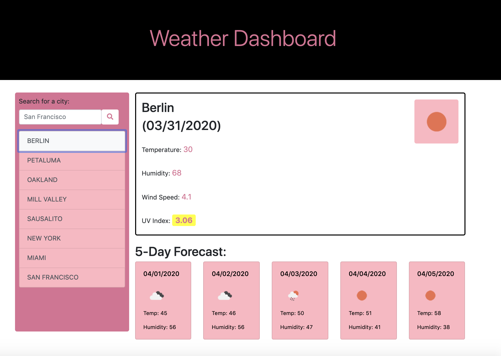

# Weather Dashboard

This is a weather dashboard that will run in the browser and feature dynamically updated HTML and CSS. The weather data will be retrieved from a Third-party API.

## User Story

```
AS A world traveler
I WANT to see the weather outlook for multiple cities
SO THAT I can plan a trip accordingly
```

## Acceptance Criteria

```
GIVEN a weather dashboard with form inputs
IF I search for a city
THEN I am presented with current and future conditions for that city and that city is added to the search history
IF I view current weather conditions for that city
THEN I am presented with the city name, the date, an icon representation of weather conditions, the temperature, the humidity, the wind speed, and the UV index
IF I view the UV index
THEN I am presented with a color that indicates whether the conditions are favorable, moderate, or severe
IF I view future weather conditions for that city
THEN I am presented with a 5-day forecast that displays the date, an icon representation of weather conditions, the temperature, and the humidity
IF I click on a city in the search history
THEN I am again presented with current and future conditions for that city
```

The following image demonstrates the application functionality:



#
Example of AJAX call to third party API
```
function getCurrentData() {

    var queryURL = "https://api.openweathermap.org/data/2.5/weather?q=" + city + "&APPID=d953636a06fd6af8b2c881b86b574429";

    $.ajax({
        url: queryURL,
        method: "GET"
    }).then(function (response) {

        // Get data for today's weather
        name = response.name;
        temperature = response.main.temp;
        iconImg = response.weather[0].icon;
        humidity = response.main.humidity;
        wind = response.wind.speed;
        lat = response.coord.lat;
        long = response.coord.lon;

        // Get UV index
        getUVIndex();

    })
}
```


## Technologies Used
- HTML - used to create elements on the DOM
- CSS - styles html elements on page
- Javascript - to create functionality of quiz
- jQuery - simplified DOM manipulation
- JSON - data formatting
- Moment.js - library to work with date and time
- AJAX - to make calls to third party APIs
- Git - version control system to track changes to source code
- GitHub - hosts repository that can be deployed to GitHub Pages

### Author links
[LinkedIn](https://www.linkedin.com/in/nadine-bundschuh-731233b9)
|
[GitHub](https://github.com/nadineb1160)

### Author Names
- Nadine Bundschuh
